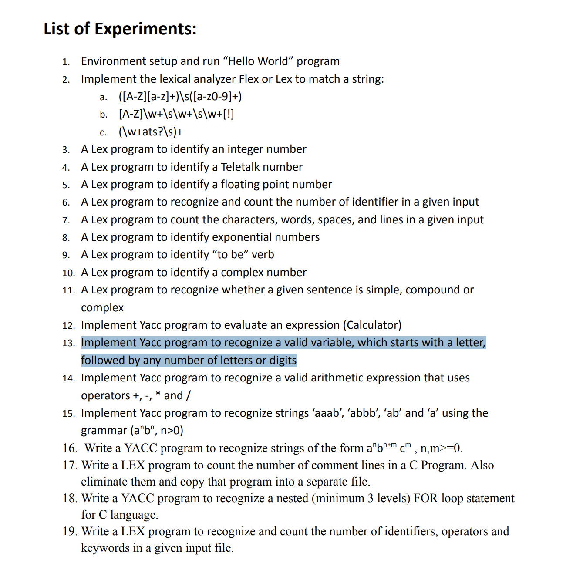

# Yacc and Lex Programs

This repository contains various Yacc and Lex-based programs for parsing and lexical analysis. Each program demonstrates the use of Yacc (Yet Another Compiler Compiler) and Lex (Lexical Analyzer) to solve specific problems related to language processing.

## Table of Contents



---

## Valid Variable Name Checker

### Description:
This program checks whether a given string is a valid variable name in a programming language. It follows the rules for valid variable names, such as:
- Starting with a letter or underscore.
- Containing only alphanumeric characters or underscores.

### Files:
- `parser.y`: Yacc file for parsing variable names.
- `lexer.l`: Lex file for tokenizing input strings.

### How to Run(Lex codes):
```bash
flex filename.l
gcc -o code lex.yy.c -ll
./code
```


### How to Run(Yacc codes):
```bash
yacc -d parser.y
flex lexer.l
gcc y.tab.c lex.yy.c -o code -lfl
./code
```
